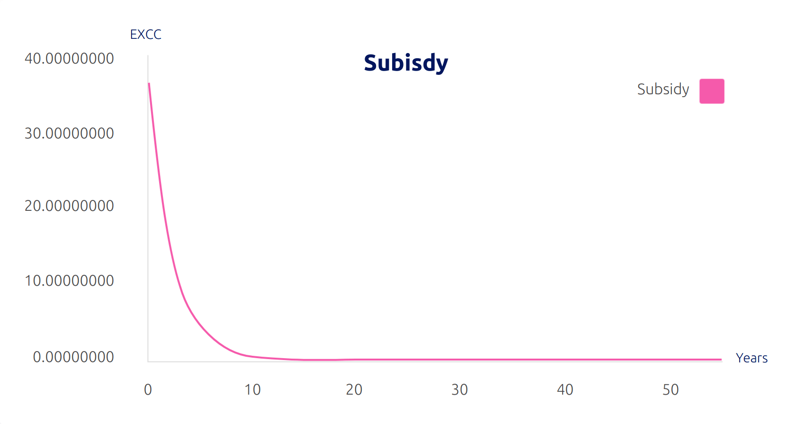
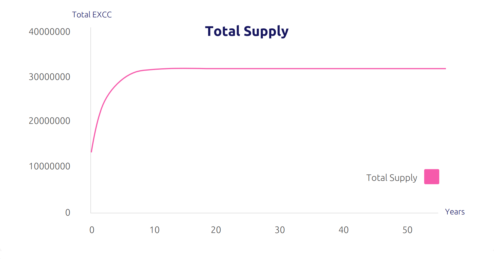

# Issuance

---

The ExchangeCoin blockchain employs a hybrid consensus mechanism, combining Proof-of-Work (PoW) and Proof-of-Stake (PoS) to ensure optimal security and performance. The blockchain utilizes the Equihash (N=144, K=5) PoW algorithm, which is specifically designed to be ASIC resistant. This approach enables all ExchangeCoin supporters to actively participate in securing transactions through mining, while simultaneously preventing centralization of computational power by a single actor, an issue that has plagued other blockchain networks.

!!! note "Note"

     The ExchangeCoin blockchain generates a new block approximately every 150 seconds, with an initial block creation reward of 38 EXCC for each block. This reward is allocated between miners and stakers according to predetermined proportions.

The decision to adopt a PoW + PoS hybrid consensus algorithm was made to address the vulnerability of PoW-only networks to 51% attacks. When a miner gains control of 51% of a network's hashing power, they could potentially execute a hard fork or reverse transactions. By incorporating PoS as a second layer of consensus, the ExchangeCoin blockchain is better protected against such threats, as each block is validated through a random selection of votes.

Furthermore, the use of the ASIC-resistant Equihash algorithm ensures that mining ExchangeCoin remains accessible to a broader range of users, including those with CPU rigs and GPU cards. By supporting GPU mining, the PoW aspect of the blockchain is further decentralized, as a greater number of users with GPU mini-capabilities can engage in mining activities compared to those who can afford costly ASIC machines.

## EXCC Parameters

| Coin Consensus                 | PoW Algorithm | Equihash n/k Parameters     | Maximum Coins Supply |
|--------------------------------|---------------|-----------------------------|----------------------|
| Pow+Pos                        | Equihash      | 144,5 (ASIC resistant)      | 32003133.2 EXCC      |

| Average Time Between Blocks | Starting Block Reward | PoW/PoS Mining Reward Split |
|-----------------------------|-----------------------|-----------------------------|
| 150 seconds | 38 EXCC | 70%/30% |

| Max Number Of Tickets To Validate | Max Number Of Tickets Mined Each Block |
|-----------------------------------|----------------------------------------|
| 5                                 | 20|

## EXCC Parameters

| Multiplicator | Denominator | Reduction Rate |
|---------------|-------------|----------------|
| 1.0000        | 1.03183     | 3.08%          |

| Start Subsidy | Premined Coins | Interval |
|---------------|----------------|----------|
| 38.0000 EXCC  | 8000000 EXCC   | 16128    |

| Time Per Interval | Zero Subsidy In | Staking Sh |
|-------------------|-----------------|------------|
| 27                | 53 Years        | 768        |

