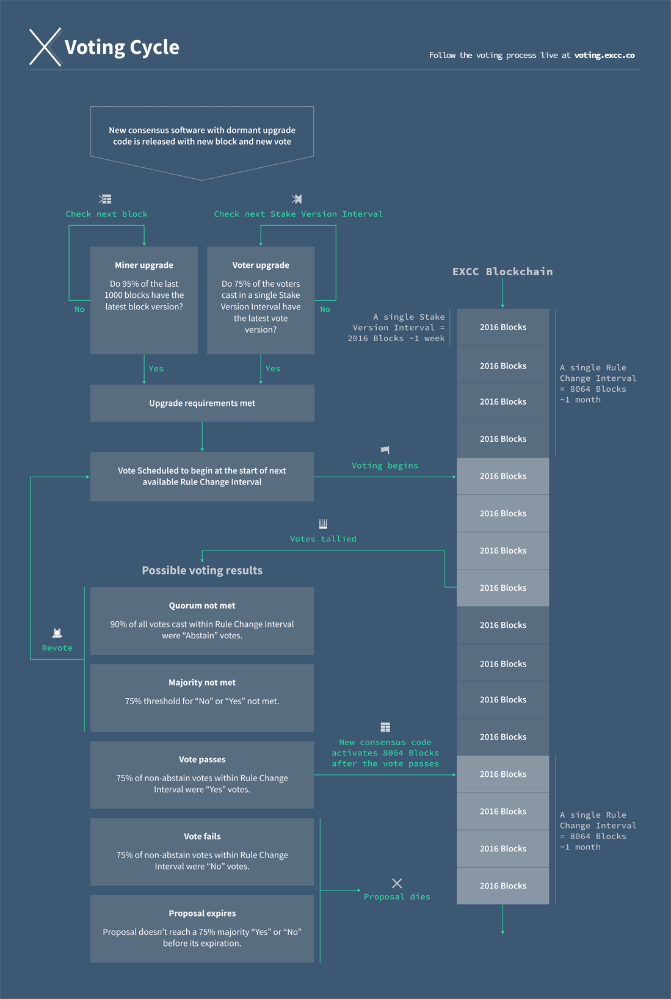

# Consensus Rule Voting

This page is intended to provide a concise overview of how consensus rule voting works and the process for setting your tickets to cast your desired vote for any agenda.

---

## Introduction

The consensus rules are a set of regulations that each full node engaged in the ExchangeCoin network must adhere to when evaluating the validity of blocks and transactions.

Examples of consensus rules include:

- The maximum size of blocks should not be exceeded.
- ExchangeCoin must not be [double-spent](../../glossary.md#double-spend).
- Blocks must meet the current [difficulty](../../glossary.md#difficulty) requirement.

It is critical that all nodes on the network utilize the same set of consensus rules. Nodes attempting to use consensus rules that differ from the majority of the network will be unable to validate blocks correctly and will eventually function on their own isolated network.

ExchangeCoin comes with an inbuilt upgrade mechanism that allows coordinated modification of the consensus rules across the entire network. This allows changes to be made predictably and without fragmenting the network, and gives proof-of-stake voters the ability to determine whether to approve the proposed changes.

The process for altering the consensus rules is outlined below.

---

## Step 1: ExchangeCoin Change Proposal (ECP)

An ExchangeCoin Change Proposal (ECP) is a formal document outlining possible changes to ExchangeCoin's protocol or consensus. An effective ECP includes a thorough explanation of the proposed alteration, justifies the rationale behind it, and provides a reference implementation.

Comprehensive documentation on the structure of ECPs, along with all previous ECPs, can be accessed in the GitHub repository [EXCCoin/ecps](https://github.com/EXCCoin/dcps).

## Step 2: New node software

New node software that incorporates the proposed consensus rule modifications must be created and made available. This software must include all code required to enforce existing consensus rules, as well as the new code that implements the changes outlined in the ECP. The new code will remain inactive until the changes have been voted on and accepted by the proof-of-stake voters.

## Step 3: Network upgrade

Before voting on the activation of new rules can commence, proof-of-work miners and proof-of-stake voters must upgrade their software to the latest version. Each has a distinct threshold to meet before the upgrade is deemed complete:

- The **proof-of-work** upgrade is considered finished once 95% of the latest 1,000 blocks are mined using the most recent version.
- The **proof-of-stake** upgrade is deemed complete once 75% of the votes in a complete [stake version interval](../../glossary.md#stake-version-interval-svi) are cast using the most recent version.

After both of these thresholds have been met, the vote is scheduled to begin on the first block of the next [rule change interval](../../glossary.md#rule-change-interval-rci).

## Step 4: Voting

Voting takes place over the course of a full [rule change interval](../../glossary.md#rule-change-interval-rci).
During this interval, each proof-of-stake ticket that is called to vote will include votebits that indicate whether the ticket holder wants to accept or reject the new rules, or if they want to abstain from voting.
If ticket holders do not explicitly set their voting preference, the default setting is to abstain, to prevent any option from having an unfair advantage in cases where ticket holders are apathetic or unaware that a vote is taking place.

Since each block can contain a maximum of five votes, and the rule change interval on mainnet is 8,064 blocks, the maximum number of votes is 40,320.
This number is intentionally very close to the target size of the ticket pool, 40,960.
Allowing almost a full ticket pool to vote ensures a good sampling of votes, and that the vote result is truly representative of stakeholders' preferences.

Every vote has a quorum requirement of 10%, which means that at least 10% of all votes cast must be non-abstaining for the result to be considered valid.

There are several potential outcomes of a vote:

1. If quorum is not met (more than 90% of all votes are "Abstain"), the agenda vote remains active for the next RCI.
2. If all non-abstaining votes within the RCI fail to meet the 75% Yes or No majority threshold, the agenda vote remains active for the next RCI.
3. If 75% of all non-abstaining votes within the RCI are in support of the agenda ("Yes"), the agenda is considered locked in, and the consensus changes will activate 8,064 blocks after the vote passed.
4. If 75% of all non-abstaining votes within the RCI are in opposition to the agenda ("No"), the agenda fails, and the consensus changes will never activate.
5. If an agenda reaches its expiration before ever reaching a 75% majority vote, the agenda expires, and the consensus changes will never activate.

## Step 5. Rule activation

If the quorum prerequisite is satisfied, and over 75% of the votes support the activation of the updated consensus rules, a "lock-in" phase commences.
This fixed duration spans 8,064 blocks (approximately 4 weeks).
Throughout this time, every participant within the ExchangeCoin network **must* update their software to the most recent version.
Upon the conclusion of this phase, all full nodes engaged in the network will autonomously enable the new rules, starting from the first block. Consequently, nodes operating on outdated software will be unable to participate further.

Below is a diagram of the entire cycle for a single agenda with consensus upgrades.

---

## Voting Preparation

To engage in the voting process, you must first acquire a wallet. If you haven't yet, refer to the [Beginner Guide](../../getting-started/beginner-guide.md), select a wallet, and follow the provided installation and configuration instructions.

Subsequently, you will need to [purchase tickets](../../proof-of-stake/how-to-stake.md) for voting using your preferred application. Make sure to acquaint yourself with the fundamentals of [Proof-of-Stake](../../proof-of-stake/overview.md) prior to obtaining tickets.

Lastly, it is essential to know how to designate the `votechoice` for your tickets in order to submit a "Yes", "No", or "Abstain" vote concerning an agenda. By default, your tickets will register "Abstain" votes. For guidance on setting your vote preference, consult our concise [How To Vote](how-to-vote.md) guide.
