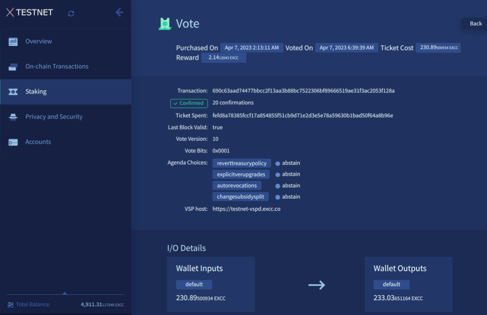

# Verifying Votes

Once a proof-of-stake ticket is summoned for on-chain voting, its voting preference becomes permanently inscribed on the ExchangeCoin blockchain.
To confirm a ticket's voting preference, one can utilize either the ExchangeCoin block explorer or the Command Line Interface (CLI).

---

## Step one: Find the vote transaction ID

Every proof-of-stake vote creates an on-chain transaction which includes the details of how the ticket is voting on the available agendas.
Finding the ID of this transaction is the first step towards verifying how the ticket voted.

### Exilibrium

Vote transactions can be found in Exilibrium by opening the History section of the Transactions tab.
This will display a list of all transactions involving the current wallet, but it is possible to filter the list  to show only vote transactions.
Clicking on a vote transaction in this list will display detailed information about the transaction, including the transaction ID.



### Command Line Interface (CLI)

`exccctl` can be used to list all the transactions of a wallet:

```no-highlight
exccctl --wallet listtransactions
```

This will yield a JSON-formatted compilation of all transactions.
Vote transactions can be recognized by examining the `txtype` field.
Below is an illustration of a vote transaction on the testnet.

```json
{
  "account": "",
  "amount": -0,
  "blockhash": "0000000004e29b89d74cccc02188f9d1b5951da1d3e9808cfc69722820bac0d9",
  "blocktime": 1550273859,
  "category": "send",
  "confirmations": 30204,
  "fee": 0,
  "time": 1553855722,
  "timereceived": 1553855722,
  "txid": "a20e541bdd08badab829510e3563875ef9929a16dcb0e8c38a32cf0fe9cadbcd",
  "txtype": "vote",
  "vout": 0,
  "walletconflicts": []
}
```

`txid` is transaction ID, the value required to check voting preferences in the next section.

---

## Step two: Verifying the Vote

After pinpointing the transaction ID of the ticket vote, the ticket's voting preferences can be determined using either the block explorer or the CLI.

### Block Explorer

To uncover the voting preferences of a ticket using [the block explorer](https://explorer.excc.co), input the previously acquired transaction ID into the search functionality at the top of the main page.
The resulting display should reveal comprehensive information about the transaction, encompassing the voting preferences.

### Command Line Interface (CLI)

In order to confirm a ticket's voting choices through the CLI, it is necessary to obtain the transaction hex by employing the `gettransaction` command.

```no-highlight
exccctl --wallet gettransaction <transaction_ID>
```

The JSON object returned by this command will have a field `hex`. This needs to be copied into the `decoderawtransaction` command.

```no-highlight
exccctl decoderawtransaction <transaction_hex>
```

This action will produce a JSON depiction of the transaction.
The vote bits for the transaction can be located within the `vout`, where the field `n` is assigned the value `1`.
To ascertain how this transaction voted on a specific agenda, the vote bits must be decoded using the mask supplied in the corresponding agenda's
