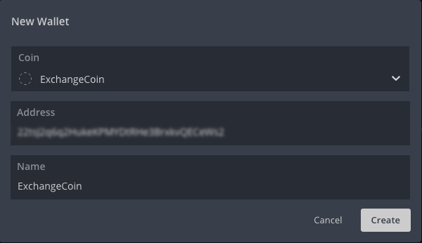
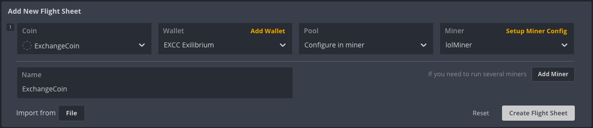
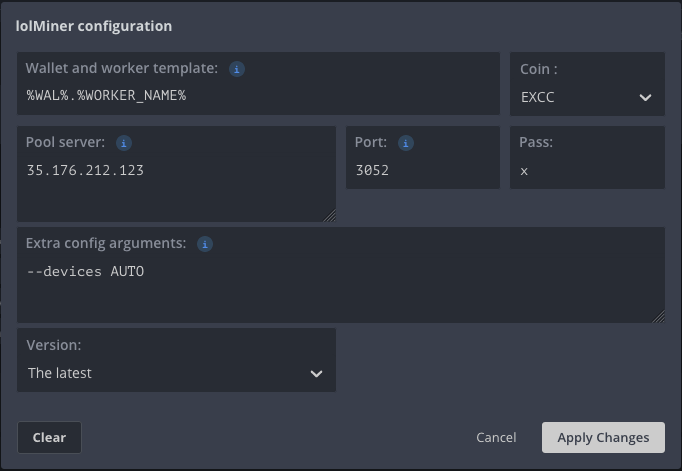
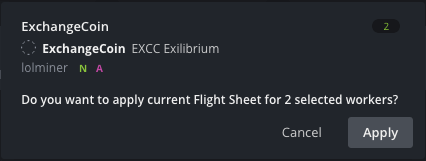

# How mine EXCC with Hiveon

---

[Hiveon](https://hiveon.com), a premier operating system specifically designed for mining rigs, offers a user-friendly experience for mining ExchangeCoin (EXCC). Utilize the following instructions for official ExchangeCoin documentation:

1. Upon logging into your farm, initiate the process by adding a new wallet:

    

    Note that you must create an ExchangeCoin entry since HiveOS does not currently have a built-in EXCC option. Type "ExchangeCoin" in the coin field, and the system will allow you to save the new coin. Input your EXCC address to designate where your mined coins will be sent. We highly recommend using the Exilibrium software for this purpose.

2. After creating a wallet and a new coin, proceed to create a new Flight Sheet. Access the Flight Sheets from the HiveOS menu and complete the form as demonstrated in the example below:

    * Coin - Choose ExchangeCoin (if not present, refer back to step 1)
    * Wallet - Select the newly created wallet
    * Pool - Opt for "Configure In Miner"
    * Miner - Choose "lolMiner" and click "Setup Miner Config"

    

3. The lolMiner configuration window will appear. Complete the form according to the example below:

    * Wallet and worker template: `%WAL%.%WORKER_NAME%`
    * Coin: `EXCC`
    * Pool server: `65.109.139.153`
    * Port: `3052`
    * Pass: `x`
    * Extra config arguments: Though optional, consider using the following recommendation from lolMiner's author: `--devices AUTO`
    * Version: `Select the latest version`

    

4.  Once you are done, just go back to your Workers list, check your workers, click Rocker icon from the top and choose your freshly made Flight Sheet.

    

