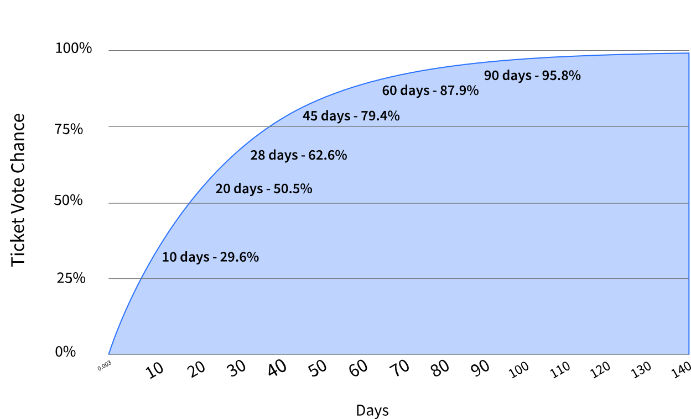

# Proof-of-Stake (PoS) Voting

---

## Overview

Proof-of-Stake (PoS) voting is a type of Proof-of-Stake (PoS) security. ExchangeCoin incorporates PoS voting as a complement to Proof-of-Work (PoW) mining, giving it a unique set of roles and characteristics.

PoS voting serves several purposes:

1. Enabling stakeholders to vote for or against proposed changes to the ExchangeCoin blockchain. If stakeholders vote in favor of a change, the chain will hard fork, and the new feature will be activated automatically. More information on voting can be found in the [Mainnet Voting Guide](../governance/consensus-rule-voting/overview.md).
2. Providing a mechanism for stakeholders to influence Proof-of-Work (PoW) miners. Stakeholders can vote to withhold a miner's reward even if the block conforms to the network's consensus rules. This allows stakeholders, in principle, to discourage problematic mining behavior such as mining empty blocks.
3. To be valid, a block must be signed by at least 3 of the 5 tickets called to vote in that block. This makes the ExchangeCoin blockchain more robust against certain types of attacks, such as those relying on secret mining.
4. The same principle makes the ExchangeCoin blockchain resistant to contentious hard forks. PoW miners cannot build on a chain without the votes of the called tickets.

These roles are incentivized; ticket holders (or "Proof-of-Stake (PoS) Voters") collectively receive 30% of the block reward when their tickets are called to vote.

---

## How Ticket Voting Works

To participate in PoS voting, stakeholders lock some EXCC in exchange for a ticket. A stakeholder can purchase one or more tickets. The amount of EXCC locked, or **Ticket Price**, is adjusted dynamically every 144 blocks (~12 hrs). The current ticket price can be found in [Exilibrium](../wallets/exilibrium/exilibrium-setup.md) or on [explorer.excc.co](https://explorer.excc.co/). Every ticket owned grants its holder the ability to cast a single vote. Upon voting, each ticket returns a small reward plus the original **Ticket Price**.

Tickets are selected pseudorandomly according to a Poisson distribution. On average, it takes 28 days for a ticket to vote, but it could take up to 142 days, with a 0.5% chance of expiring before being chosen to vote (this expiration returns the original **Ticket Price** without a reward). Every mined block must include at least 3 votes (miners are penalized by a reward deduction if fewer than 5 votes are included).

The following chart illustrates the probability of a ticket voting by day.

Every mined block can also include up to 20 new ticket purchases. A new ticket needs 256 blocks to mature before it enters the **Ticket Pool** and becomes eligible for voting.

There are several important variables to familiarize yourself with while staking:

Every 144 blocks (~12 hours), the stake difficulty algorithm calculates a new **Ticket Price** to maintain the **Ticket Pool** size close to the target pool size of 40,960 tickets. This 144 block window is called the `StakeDiffWindowSize`.

The **Ticket Price**/**Stake Difficulty** refers to the cost of a ticket during a single 144 block window.

The **Ticket Pool** represents the total number of tickets in the ExchangeCoin network.

The **Ticket Fee** (`ticketfee`) is the fee included in the ticket purchase to incentivize Proof-of-Work (PoW) miners to include the ticket in a new block. **Ticket Fee** usually refers to the EXCC/kB fee rate for a ticket purchase transaction. The **Ticket Fee** defaults to the minimum (0.0001 EXCC/kB), which is generally sufficient.

**When a ticket is called to vote, the wallet with voting rights for that ticket must be online.** If the wallet is not online to cast its vote, the ticket will be marked as `missed`, and you won't receive a reward for that ticket. In practice, **Solo Voters** often run voting wallets on multiple servers across different continents to minimize the chances of their tickets missing a call to vote.

**Voting Service Providers** (VSPs) offer a service that allows ticket buyers to delegate the act of voting to the VSP. The ticket buyer instructs the VSP on how their ticket should vote on open rule change proposals and shares voting rights with the VSP to benefit from the voting infrastructure they provide (i.e., at least three always-online servers).

VSPs charge a fee for this service, which is paid upfront before adding the ticket to the VSP's voting wallets. This fee is generally 5% or less. A list of VSPs is maintained on excc.co. VSPs do not take custody of EXCC; by using them, you only delegate the voting rights of a ticket.

---

## Ticket Lifecycle

After purchasing a ticket, it goes through several stages in its lifetime on mainnet (testnet uses different parameters):

1. You buy a ticket using Exilibrium or exccwallet wallet. The total cost of each single ticket transaction should be **Ticket Price** + **Ticket Fee**(`ticketfee`).

2. Your ticket enters the `mempool`. This is where your ticket waits to be mined by PoW miners. Only 20 fresh tickets are mined into each block.

3. Tickets are mined into a block, with higher **Ticket Fee** transactions having a higher priority. Note that the **Ticket Fee** is EXCC per KB of the transaction. A few common transaction sizes are 298 Bytes (a solo ticket purchase) and 539 Bytes (a pool ticket purchase).

4. **A -** If your ticket is mined into a block, it becomes an immature ticket. This state lasts for 256 blocks (about 20 hours). During this time, the ticket cannot vote. At this point, the ticket fee is non-refundable.

    **B -** If your ticket is not mined, both the **Ticket Price** and **Ticket Fee** are returned to the purchasing account.

5. After your ticket matures (256 blocks), it enters the **Ticket Pool** and is eligible for voting.

6. The chance of a ticket voting is based on a Poisson distribution with a mean of 28 days.

7. Given a target pool size of 40,960 tickets, any given ticket has a 99.5% chance of voting within 40,960 blocks (approximately 142 days, or 4.7 months). If, after this time, a ticket has not voted, it expires. You receive a refund on the original **Ticket Price**.

8. A ticket may miss its call to vote if the voting wallet does not respond or two valid blocks are found within close proximity of each other. If this happens, you receive a refund on the original **Ticket Price((.

9. After a ticket has voted, missed, or expired, the funds (ticket price and reward if applicable, minus the fee) will enter immature status for another 256 blocks, after which they are released. If a ticket is missed or expired, a ticket revocation transaction is submitted by the wallet which then frees up the locked ticket outputs. **NOTE**: Revocations can only be submitted for a corresponding missed ticket. You cannot revoke a ticket until it is missed.

---

## Additional Information

[Mainnet Voting Guide](../governance/consensus-rule-voting/overview.md)

[Proof-of-Stake FAQ - General](../faq/proof-of-stake/general.md)

[Proof-of-Stake FAQ - Buying Tickets and Fees](../faq/proof-of-stake/buying-tickets-and-fees.md)

[Proof-of-Stake FAQ - Solo Mining](../faq/proof-of-stake/solo-voting.md)

[Proof-of-Stake FAQ - Voting Service Providers](../faq/proof-of-stake/voting-service-providers.md)
