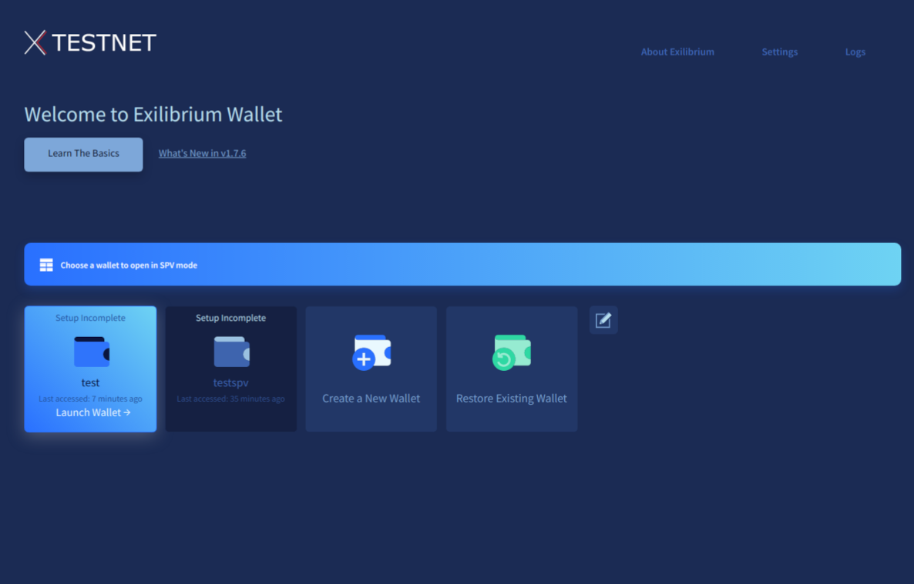
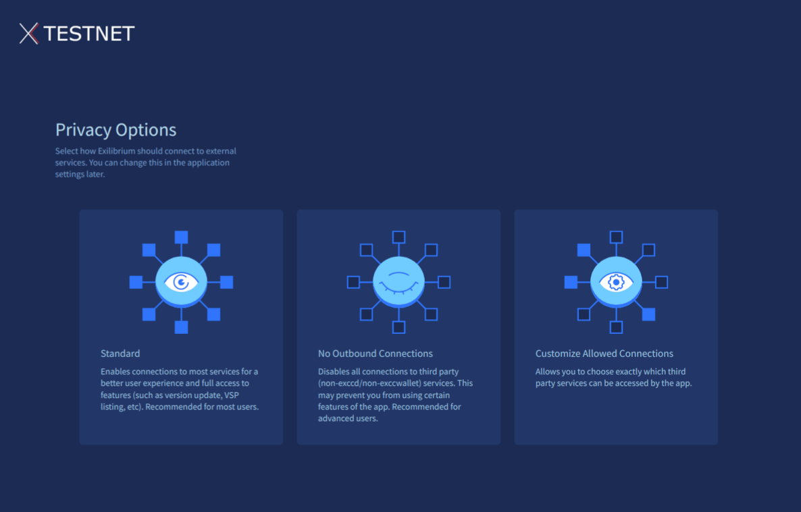
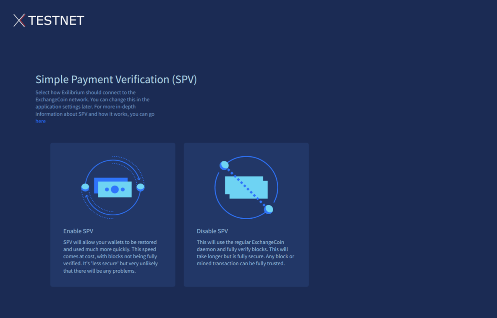
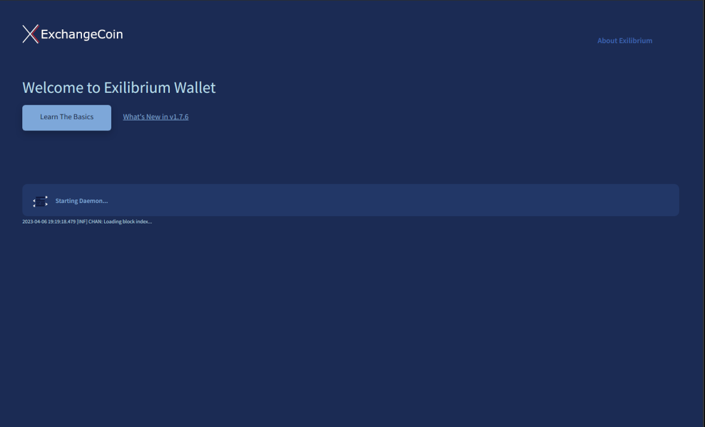
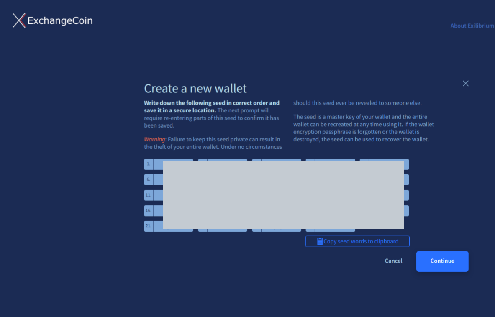
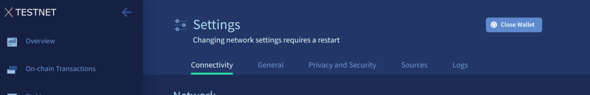

# Exilibrium Setup Guide

Last updated for Exilibrium v{{ exilibriumversion }}.

---

`Exilibrium` is a graphical user interface for `exccwallet`. When this application launches, it automatically starts its own instance of the command line tools `exccd` and `exccwallet` in the background.

!!! info "Blockchain Download"

    In the absence of [SPV](../../wallets/spv.md) activation, Exilibrium necessitates a complete download of the ExchangeCoin blockchain before utilization. Consequently, a substantial download is required, along with ample storage space on the device where Exilibrium is installed. The current size of all serialized blocks can be verified through [exccdata charts](https://explorer.excc.co/charts?chart=blockchain-size). The overall size of Exilibrium will be larger, as it also stores additional wallet data on your device.

---

## Download and Install

The latest version of Exilibrium can be downloaded from <https://excc.co/wallets/>.

--8<-- "verify-hashes.md"

=== "Windows"

    1. Download the Windows installer `exilibrium-v{{ exilibriumversion }}.exe`.

    2. Double click the installer and follow the instructions.

    3. The installer adds a shortcut to Exilibrium on your desktop.

=== "macOS"

    1. Download the `exilibrium-v{{ exilibriumversion }}.dmg` file.

    2. Double click the `exilibrium-v{{ exilibriumversion }}.dmg` file to mount the disk image.

    3. Drag the `exilibrium.app` file into the link to your Applications folder within the disk image.

=== "Linux .tar.gz file"

    1. Download the `exilibrium-v{{ exilibriumversion }}.tar.gz` file.

    2. Navigate to the download location and extract `exilibrium-v{{ exilibriumversion }}.tar.gz`.

    3. The extracted files include an executable named `exilibrium`.
    
    4. Open a terminal in the extracted folder and run the command `chmod u+x exilibrium`.
    
    5. Exilibrium can then be launched from the terminal using the command `./exilibrium`.

=== "Linux - other flavours"

    1. Visit [Release Binaries](https://github.com/EXCCoin/excc-binaries/releases) page.

    2. Choose from many other variants of exilibrium like AppImage, pacman package.

=== "Linux - no Intel"

    1. Visit [Release Binaries](https://github.com/EXCCoin/excc-binaries/releases) page.

    2. Choose from many other variants of exilibrium for ppc64LE, ARM.

---

## Open and Set Up Exilibrium

Opening Exilibrium for the first time will display the following screen:

Choose your preferred language and click **Continue**. Subsequently, you will be presented with multiple privacy settings, enabling you to control the external services Exilibrium contacts. For the majority of users, the **Standard** option is advisable, as it grants access to all Exilibrium features and delivers an optimal user experience.

A display will appear, providing the option to activate SPV mode if desired.

Upon making your selection, a brief presentation covering the ExchangeCoin blockchain, wallet, keys, staking/governance, and security recommendations is presented. If you are new to ExchangeCoin, please review these slides attentively.

The following screen should be displayed next.

A prominent progress bar on this screen indicates the blockchain download's advancement. If you opted to enable SPV mode, this bar will fill up instantly, as downloading the blockchain is unnecessary.

!!! info "Pausing the download"

    Should you close Exilibrium or power off your computer during the download process, the download will pause without losing progress. Upon the next launch of Exilibrium, the download will resume from where it left off.

    Consequently, you can complete the blockchain download across multiple sessions if needed.

When the download has completed you can set up your wallet. You have two options:

1. [Create a New Wallet](#create-a-new-wallet) - Press this button if this is your first time using ExchangeCoin.

2. [Restore Existing Wallet](#restore-existing-wallet) - Press this button if you already have a wallet seed you would like to recover.

---

## Create a New Wallet

Since Exilibrium enables the management of multiple wallets on a single PC, it is essential to assign a name to your wallet for identification purposes. Enter a name and click the **Continue** button.

--8<-- "seed-warning.md"

The 24 word seed for your new wallet is displayed on the screen (obscured in the below image). Record the seed and store it somewhere safe.

Click Continue and input the omitted words from your seed on the subsequent screen. This step ensures that you have accurately documented your seed.

Establish a passphrase for your wallet. This passphrase will be employed to unlock your wallet when generating transactions.

Click **Create Wallet** to finalize the wallet setup. You will be redirected to the blockchain download progress bar. Upon completion of the download, Exilibrium will display the Overview page for your new wallet, allowing you to start sending and receiving ExchangeCoin.

---

## Restore Existing Wallet

1. Open Exilibrium and click on **Restore Existing Wallet**. If Exilibrium is open, and you have another wallet open, you'll need to first go to Settings and click **Close Wallet**.

    

2. Name your wallet. As Exilibrium allows you to manage multiple wallets on one PC, you must give a name to your wallet, so it can be identified.

3. Advanced users can use the "Watch only" option and enter a public key to configure a watch only wallet.

4. Enter your seed into the **Confirm Seed** text box.

5. Create a private passphrase for your wallet.

6. Select **Create Wallet**. Wait for the blockchain to be downloaded.

7. The blockchain will now be scanned for any transactions belonging to this wallet.
