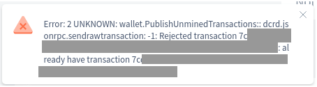

# Troubleshooting Common Exilibrium Problems

Last updated for Exilibrium v{{ exilibriumversion }}.

!!! danger "Critical Information"

    Before initiating any repair attempts for a malfunctioning wallet, confirm that you have your accurate 24-word seed documented (ideally, on a physical paper) and within reach.

    In case your seed is lost, there is a high risk of permanently losing access to your funds. Refer to the ["I have lost my seed"](../../faq/wallets-and-seeds.md#9-i-have-lost-my-seed-what-can-i-do) section in the seed FAQ for guidance in such a scenario.

## Location of data and log files

The main directory for Exilibrium data files is OS-dependent:

| OS      | Exilibrium data directory                   |
| -------:|:-------------------------------------------:|
| Windows | `%LOCALAPPDATA%\Exilibrium\`                |
| macOS   | `~/Library/Application Support/exilibrium/` |
| Linux   | `~/.config/exilibrium/`                     |

There are different log files which may be reviewed when troubleshooting a problem:

| Log          | Location                                      |
| ------------:|:---------------------------------------------:|
| Main app log | `exilibrium.log`                              |
| Wallet log   | `wallets/mainnet/[name of wallet]/wallet.log` |

And finally, the blockchain (exccd) log is located in:

| OS      | Exilibrium data directory                   |
| -------:|:-------------------------------------------:|
| Windows | `%LOCALAPPDATA%\exccd\`                      |
| macOS   | `~/Library/Application Support/exccd/`       |
| Linux   | `~/.exccd/logs`                              |

## Running in debug mode

For efficient troubleshooting, execute the debug mode within a terminal (command line console window). Open a terminal (`cmd.exe` on Windows), navigate to the Exilibrium installation directory, and run it:

```no-highlight
# Linux/macOS:
$ ./exilibrium --debug

# Windows:
c:\[...]> exilibrium.exe --debug
```

## Cannot see all my coins after restoring from seed

1. Ensure that the blockchain is synchronized with the most recent block. Observe the block height in the lower left corner of the screen and the latest block from [explorer.excc.co](https://explorer.excc.co)

    

2. Import **all** previously used voting service provider ("stakepool") API keys with this wallet. Failure to do so for all pools **will** result in an inaccurate balance.

3. Rebroadcast any pending transactions (open the transaction and click "Rebroadcast") and check the block explorer for successful publication and mining.

4. Conduct a comprehensive rescan of transactions (click the small refresh icon next to the "Latest Block" label).

## Exilibrium will not start (exccd closed due to an error)

```no-highlight
exccd closed due to an error. Check exccd logs
and contact support if the issue persists.
```

Typically, this error occurs in three situations:

- An instance of `exccd` is already running on your computer
- The `exccd` process or the blockchain data is corrupted
- A program (such as antivirus, protection software or firewall) is obstructing the `exccd` process from running properly

Consider the following:

1. Inspect your OS task manager for any `exccd` process, and terminate it.

2. Examine the [exccd logs](#location-of-data-and-log-files) for any `ERR` messages (begin at the bottom of the file for the most recent messages).

3. If the blockchain is corrupted, delete the exccd data folder and restart synchronization.

4. Deactivate any antivirus or protection software and attempt to run again. Check if firewall is not blocking connection of `exccd` to the network.

4. Execute Exilibrium's `exccd` version in the terminal and search for any fatal messages or panics.

## Error "Already Have Transaction..."



If you encounter a message like the one above, it signifies that your exccd node already possesses the transaction you are attempting to publish. This is harmless, but if the transaction remains pending for an extended period, consider the following:

- Rebroadcast the transaction using the button in the Transactions tab
- Verify whether your transaction has been broadcast using the [block explorer](https://explorer.excc.co/)
- Perform a rescan

## Cannot Purchase Tickets


This is usually caused by shutting down Exilibrium before a ticket has been mined.

Perform the same steps as described in ["Cannot see all my coins"](#cannot-see-all-my-coins-after-restoring-from-seed)

## Debugging Other Errors

If your wallet starts but encounters error messages when executing an operation, begin by examining the wallet logs from within Exilibrium. Navigate to Settings -> Logs and search for any `ERR` messages:


