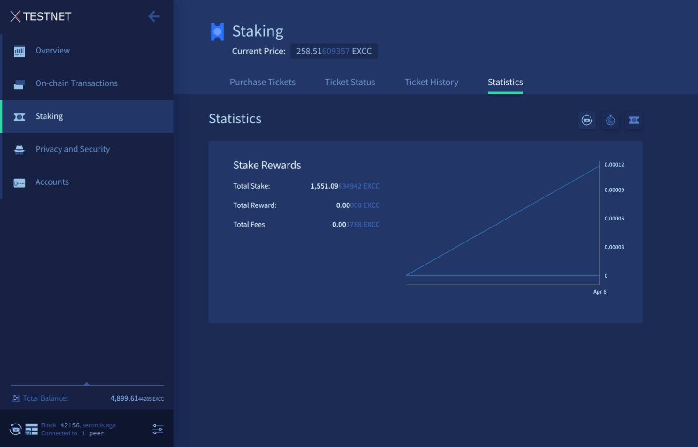

# Using Exilibrium

Last updated for Exilibrium v{{ exilibriumversion }}.

This guide assumes you have already set up a Exilibrium wallet using [the Exilibrium Setup guide](exilibrium-setup.md).

---

## Main menu

Exilibrium's main menu is situated on the left side of the window, allowing you to navigate between its various features. To minimize the menu, click the arrow icon at the top. A button to rescan the blockchain is located at the menu's bottom. Pressing this button triggers a rescan of all your owned addresses to identify new transactions, potentially resolving discrepancies in displayed balances. While this operation may be time-consuming, it does not necessitate a complete redownload of the blockchain.

---

## Overview

The overview tab gives a quick summary of your total EXCC (available and locked in tickets) and a list of recent transactions.

Graphs of your balance, ticket activity and transaction history over the last two weeks can be viewed here.

---

## On-chain Transactions

The on-chain transactions tab is split into four sections:

### Send

This is where you can transfer ExchangeCoin from your wallet to another address. First, select the account in your wallet from which to send funds, and then input the recipient's address in the text box. Finally, enter the amount of ExchangeCoin you wish to send.

Additional buttons are available for creating more advanced transactions if necessary. The **+** button enables sending ExchangeCoin to multiple addresses in a single transaction. The **Send All** button generates a transaction that fully empties the chosen account. Another button allows transferring funds between accounts within your wallet.

Once you've entered your transaction details, the estimated fee and transaction size are displayed below the input panels. After reviewing these figures, press the **Send** button to broadcast your transaction.

### Receive

This section allows you to generate wallet addresses to share with others so they can send you EXCC. The address is displayed in the blue text box - it's the line that starts with Ds, or Ts on the testnet. Simply choose the account you want funds directed to and click the **Generate New Address** button.

ExchangeCoin addresses can be reused multiple times, but generating a new one for each transaction is advisable for privacy reasons. With approximately 1.4E48 (14 followed by 47 zeros) addresses available, you don't need to worry about running out.

### History

This tab displays a list of all transactions involving this wallet. A dropdown menu enables you to filter the list by transaction type: regular, ticket, and vote transactions. The transaction hash can be used with the [block explorer](../../getting-started/using-the-block-explorer.md) to access more information about the transaction.

### Export

This tab enables you to export your transaction history in a .csv format. You can select the data you want to export, choose a location for the output file, and then click the **Export** button.

<!-- TODO add Lightning Transactions here -->

---

## Staking

The staking tab is split into four sections:

### Purchase Tickets

The total number of tickets you currently own is at the top of the page:

- **Mempool Tickets** - Tickets waiting to be mined by PoW miners (only 20 new tickets are mined into each block)
- **Immature Tickets** - Mined tickets which cannot vote until a 256 block maturing period has passed (around 20 hours)
- **Live Tickets** - Mature tickets eligible to be called to vote

#### Purchasing tickets

To purchase tickets, simply select the account from which to buy tickets, specify the number of tickets you want to acquire, choose a VSP to utilize, and then click the **Purchase** button.

The "Automatic Ticket Buyer" panel lets you enable the automated ticket buyer, which allows Exilibrium to continuously purchase tickets on your behalf as long as it is running. You can configure the ticket buyer's functionality using the available options:

- **VSP** - Which VSP to purchase tickets with
- **From** - Funds to purchase tickets will come from this account
- **Balance to maintain** - If your balance is lower than this number, you will not buy tickets. The default of 0 will use all the funds in your account to buy tickets

### Tickets Status

This tab shows a summary of all of your immature and live tickets. Filters and sorting options are available to make browsing the list easier.

### Historic Tickets

This tab shows a summary of all of your tickets which voted, expired or were missed. Filters and sorting options are available to make browsing the list easier.

### Statistics

This page presents various statistics related to all available VSPs. Use the dropdown menu to switch between different VSPs on display.

---

## Privacy and Security

The Security Center tab offers two key features - the ability to sign and verify messages using your private key, and the ability to validate addresses.

### Sign and Verify messages

Signing a message with an address's private key provides a means of demonstrating to a third party that you are the owner of a particular address.

For example, suppose you sent 100 EXCC to a merchant and have not yet received your goods. You contact the merchant and explain the situation, but require a means of proving that you indeed own the address that the funds were transferred from. You can generate a signature using a message known solely to you and your counterparty, along with the private key associated with the address. Upon receiving the signed message, the counterparty may use the Verify Message form to confirm the signature's authenticity.

### Validate Addresses

A ExchangeCoin address can be entered into the Validate Address text box, and Exilibrium will put that address into one of three categories:

- Invalid address
- Valid address owned by the current wallet
- Valid address not owned by the current wallet

---

## Accounts

The Accounts tab displays all of the accounts in your wallet and enables you to create new ones.

Accounts in ExchangeCoin operate in a manner analogous to bank accounts, allowing you to maintain distinct records of your EXCC. This functionality is particularly beneficial for business owners who may wish to create separate accounts for tax purposes. When transferring EXCC between accounts, a transaction is created on the blockchain.

---

## Settings

The settings tab allows you to customize the units EXCC amounts are displayed in and also allows you to switch Exilibrium onto the testnet blockchain.

The settings tab is also where you come to change your private passphrase.

